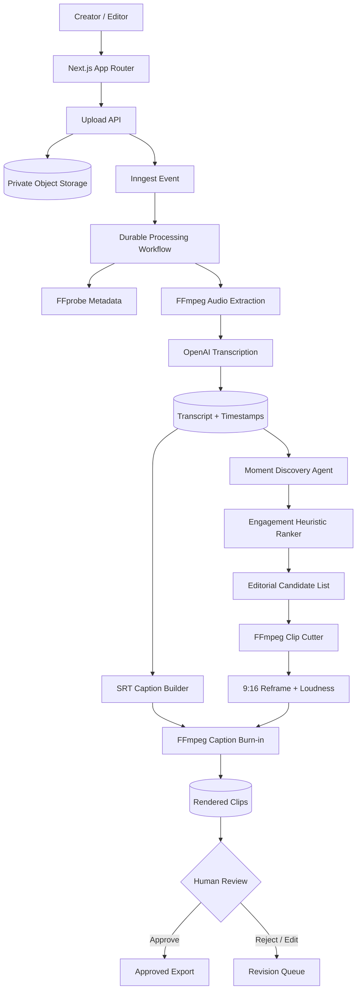
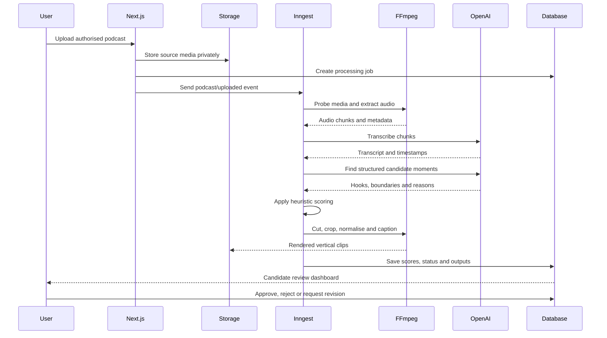

<div align="center">

# 🎬 ClipForge AI

### Agentic Podcast-to-Clip Engine for Transcription, Viral-Moment Discovery, Captions and Short-Form Editing

Upload a long-form podcast you own or are authorised to edit. ClipForge transcribes it, identifies high-value moments, ranks candidates with transparent engagement heuristics, renders vertical clips with captions, and routes outputs through human review.

**Next.js • OpenAI Transcription • FFmpeg • Inngest • Supabase • TypeScript**

> “Predicted engagement” is a heuristic ranking signal, not a promise of views, reach, virality, or platform performance.

</div>

---

## 🌟 Why ClipForge?

Turning a 60 to 120-minute podcast into useful short-form clips is repetitive work. Editors must transcribe the recording, review the full conversation, identify moments with a complete narrative arc, cut the video, reframe it for vertical viewing, add captions, and compare multiple candidates.

ClipForge automates the repetitive stages while keeping the final editorial decision with a human.

## ✨ What It Does

- Uploads long-form MP4, MOV, WebM, MP3, WAV, or M4A media
- Stores source media privately
- Extracts audio with FFmpeg
- Transcribes using OpenAI's transcription API
- Preserves segment and word timestamps when available
- Finds candidate moments using structured AI analysis
- Scores candidates with explainable editorial heuristics
- Cuts clips with safe start and end boundaries
- Converts clips to 9:16 vertical video
- Generates SRT captions from timed words
- Burns captions into video using FFmpeg/libass
- Produces titles, hooks, descriptions, and hashtags
- Shows processing progress through durable Inngest steps
- Requires human review before a clip is marked approved

OpenAI recommends file transcription for completed recordings and provides specialised options when word timestamps, subtitles, or speaker labels are required. Current file uploads are bounded by documented file-size and format constraints, so this project extracts and chunks audio before transcription. citeturn33search67turn33search68

Inngest provides durable, retriable background functions for Next.js, with event triggers, step checkpoints, retries, observability, and a local development server. citeturn33search61turn33search62

FFmpeg provides command-line media conversion, stream selection, scaling, filtering, and subtitle rendering. Burned-in captions can be produced with the `subtitles` or `ass` filters when FFmpeg includes libass support. citeturn33search73turn33search74turn33search78

## 🏗️ System Architecture



## 🔄 End-to-End Pipeline



## 🧠 Agentic Editing Pipeline

```text
MEDIA INGESTION
Upload → Validate → Store → Probe → Extract Audio

AI UNDERSTANDING
Chunk Audio → Transcribe → Merge Timestamps → Analyse Narrative

MOMENT DISCOVERY
Hook Detection → Self-contained Context → Emotional / Practical Value
→ Boundary Selection → Safety Check → Candidate Generation

RANKING
Hook Strength + Clarity + Novelty + Specificity + Emotion
+ Standalone Value + Caption Density - Context Dependency - Risk

RENDERING
Cut → Reframe 9:16 → Normalise Audio → Generate SRT
→ Burn Captions → Export MP4 → Thumbnail Frame

EDITORIAL CONTROL
Preview → Adjust Boundaries → Edit Captions → Approve / Reject
```

## 📈 Engagement Ranking

ClipForge does not claim to predict platform algorithms. It produces a transparent editorial score from 0 to 100.

```text
score =
  20% hook strength
+ 15% standalone clarity
+ 15% specificity
+ 15% practical or emotional value
+ 10% novelty
+ 10% pacing / information density
+ 10% caption readability
+  5% clean ending
- context dependency penalty
- unsafe or unsupported claim penalty
```

Each candidate displays its component scores and explanation. Editors can override the ranking.

## 🎯 Candidate Moment Schema

```json
{
  "title": "The hidden cost of shipping too early",
  "hook": "Most teams think speed is free. It is not.",
  "startSeconds": 622.4,
  "endSeconds": 674.8,
  "durationSeconds": 52.4,
  "reason": "Strong contrarian hook followed by a complete example and clear takeaway.",
  "scores": {
    "hook": 88,
    "clarity": 84,
    "specificity": 78,
    "value": 86,
    "novelty": 72,
    "pacing": 80,
    "captionReadability": 90,
    "ending": 82
  },
  "predictedEngagementScore": 83,
  "reviewStatus": "pending"
}
```

## 🔐 Rights, Privacy and Editorial Safety

- Upload only media you own or are authorised to process
- Do not upload confidential calls or private recordings without consent
- Source media and rendered clips should use private storage
- Signed URLs should expire
- Provider keys remain server-side
- All candidate clips remain pending until human review
- The system should flag unsupported medical, financial, legal, or defamatory claims
- The project does not impersonate speakers or generate synthetic speech
- The project does not auto-publish to social platforms
- Delete source media and derived assets according to retention policy

## 🛠️ Technology Stack

### Frontend

- Next.js App Router
- React
- TypeScript
- Responsive clip-review dashboard
- HTML5 video preview

### AI

- OpenAI transcription
- Word and segment timestamps
- Structured candidate-moment extraction
- Caption metadata generation
- Editorial scoring heuristics

### Media

- FFmpeg
- FFprobe
- Audio extraction
- Vertical reframing
- Loudness normalisation
- SRT and ASS captions
- Caption burn-in
- Thumbnail extraction

### Durable Workflows

- Inngest events
- Retriable steps
- Step-level checkpoints
- Concurrency controls
- Local Dev Server

### Data

- Supabase-ready Postgres schema
- Private object storage interface
- Jobs, transcripts, candidates, clips and review states

## 📁 Project Structure

```text
clipforge-ai/
├── app/
│   ├── api/
│   │   ├── inngest/route.ts
│   │   ├── jobs/route.ts
│   │   ├── upload/route.ts
│   │   └── clips/[id]/review/route.ts
│   ├── jobs/[id]/page.tsx
│   ├── upload/page.tsx
│   ├── globals.css
│   ├── layout.tsx
│   └── page.tsx
├── components/
│   ├── clip-card.tsx
│   ├── score-breakdown.tsx
│   ├── upload-form.tsx
│   └── video-preview.tsx
├── inngest/
│   ├── client.ts
│   └── functions.ts
├── lib/
│   ├── captions.ts
│   ├── ffmpeg.ts
│   ├── moments.ts
│   ├── openai.ts
│   ├── scoring.ts
│   ├── storage.ts
│   └── types.ts
├── supabase/migrations/001_clipforge.sql
├── tests/
│   ├── captions.test.ts
│   └── scoring.test.ts
├── .env.example
├── Dockerfile
├── package.json
└── README.md
```

## ⚡ Quick Start

### Prerequisites

- Node.js 20+
- npm
- FFmpeg and FFprobe available on PATH
- OpenAI API key
- Inngest account or local Dev Server
- Supabase project or compatible storage/database implementation

### 1. Clone

```bash
git clone https://github.com/sgt-9304/ClipForge-AI.git
cd ClipForge-AI
```

### 2. Install

```bash
npm install
```

### 3. Configure

```bash
cp .env.example .env.local
```

Windows:

```powershell
copy .env.example .env.local
```

### 4. Apply the migration

Run in Supabase SQL Editor:

```text
supabase/migrations/001_clipforge.sql
```

Create private buckets:

```text
podcast-sources
podcast-clips
```

### 5. Start Next.js

```bash
npm run dev
```

### 6. Start Inngest Dev Server

```bash
npx inngest-cli@latest dev
```

Open:

```text
App: http://localhost:3000
Inngest: http://localhost:8288
```

Inngest's Next.js quick start uses an `/api/inngest` handler to discover and execute durable functions. citeturn33search61

## 🔧 Environment Variables

```env
NEXT_PUBLIC_SUPABASE_URL=
NEXT_PUBLIC_SUPABASE_ANON_KEY=
SUPABASE_SERVICE_ROLE_KEY=
OPENAI_API_KEY=
OPENAI_TRANSCRIPTION_MODEL=gpt-transcribe
OPENAI_EDITOR_MODEL=gpt-5-mini
INNGEST_EVENT_KEY=
INNGEST_SIGNING_KEY=
SOURCE_BUCKET=podcast-sources
CLIP_BUCKET=podcast-clips
FFMPEG_PATH=ffmpeg
FFPROBE_PATH=ffprobe
MAX_UPLOAD_MB=500
MAX_CLIPS_PER_JOB=8
```

Never commit `.env.local`.

## 🔌 API Routes

### Upload podcast

```http
POST /api/upload
Content-Type: multipart/form-data
```

### Create processing job

```http
POST /api/jobs
```

```json
{
  "sourcePath": "user-id/podcast.mp4",
  "title": "Founder Stories Episode 12",
  "targetDurationMin": 30,
  "targetDurationMax": 75,
  "maxCandidates": 8
}
```

### Review clip

```http
POST /api/clips/{clip_id}/review
```

```json
{
  "decision": "approved",
  "editorNotes": "Strong hook. Caption correction completed."
}
```

## 🎞️ FFmpeg Rendering Flow

```text
Input Video
  ↓ ffprobe
Duration, Resolution, Streams
  ↓ ffmpeg -vn
Mono/Stereo Audio for Transcription
  ↓ transcript timestamps
Candidate Start / End
  ↓ ffmpeg -ss / -t
Source Clip
  ↓ scale + crop / pad
1080 × 1920 Vertical Clip
  ↓ loudnorm
Normalised Audio
  ↓ subtitles / ass
Burned Captions
  ↓ thumbnail extraction
MP4 + JPG Output
```

The subtitle filter requires an FFmpeg build with libass, while FFmpeg filtergraphs provide the scaling, cropping, overlay, and audio-filter stages. citeturn33search74turn33search78

## 📝 Caption Generation

Timed words are grouped into short caption cues:

- 4 to 8 words per line
- Maximum two lines
- Cue boundaries follow punctuation and pauses
- Timestamps remain inside clip boundaries
- Captions can be exported as SRT
- Burn-in is optional

## ♻️ Durable Inngest Workflow

```text
podcast/uploaded event
    ↓
probe-media
    ↓
extract-audio
    ↓
transcribe-audio-chunks
    ↓
merge-transcript
    ↓
find-candidate-moments
    ↓
score-and-rank
    ↓
render-clips (parallel)
    ↓
generate-thumbnails
    ↓
save-results
```

Each step is independently retriable. Inngest records execution history and resumes from completed checkpoints instead of restarting the entire workflow. citeturn33search61turn33search62

## ✅ Testing

```bash
npm run test
npm run build
```

Tests cover caption cue generation and engagement heuristic scoring.

## 🐳 Docker

```bash
docker compose up --build
```

The Docker image installs FFmpeg before building the Next.js app.

## 🚧 Known Limitations

- “Viral” ranking is heuristic and cannot predict platform reach
- FFmpeg rendering is compute-intensive
- Automatic face tracking and smart reframing are not included yet
- Transcription costs scale with media duration
- OpenAI file limits require chunking larger extracted audio
- Multi-speaker overlap can reduce transcript quality
- Captions require manual correction before publication
- No direct social-platform publishing is included
- The default storage adapter requires configuration

## 📊 Evaluation Plan

Measure:

- Word error rate
- Timestamp alignment error
- Candidate boundary quality
- Editor acceptance rate
- Hook-score agreement with editors
- Caption correction rate
- Render success rate
- Average processing time per media hour
- Cost per processed hour
- Post-publication engagement only as retrospective evidence

Do not publish invented engagement accuracy. Compare rankings against real editor decisions and authorised historical performance.

## 🗺️ Roadmap

- [ ] Active speaker detection and smart face tracking
- [ ] Split-screen podcast layouts
- [ ] Editable caption timeline
- [ ] Brand templates and safe zones
- [ ] B-roll recommendation agent
- [ ] Multiple aspect ratios
- [ ] Clip versioning and A/B hooks
- [ ] Trigger.dev provider alternative
- [ ] Social-platform export integrations
- [ ] Cost and processing dashboard
- [ ] Human feedback learning loop

## 🤝 Suggested Contributions

- `good first issue`: Add WebVTT export
- `good first issue`: Add caption theme presets
- `ffmpeg`: Add multiple aspect ratios
- `frontend`: Build timeline editor
- `vision`: Add active-speaker crop tracking
- `workflow`: Add Trigger.dev adapter
- `evaluation`: Add editor acceptance benchmark
- `security`: Add complete storage RLS policies

Do not upload copyrighted podcasts without permission, private recordings, credentials, or confidential client media.

## 📄 License

MIT for the reference code. Users remain responsible for media rights, model/API terms, music licensing, privacy, and platform policies.

<div align="center">

### One long conversation. Several editor-reviewed short stories.

**Transcribe • Discover • Rank • Render • Review**

⭐ Star the repository if the media-processing and agentic-editing architecture is useful.

</div>
